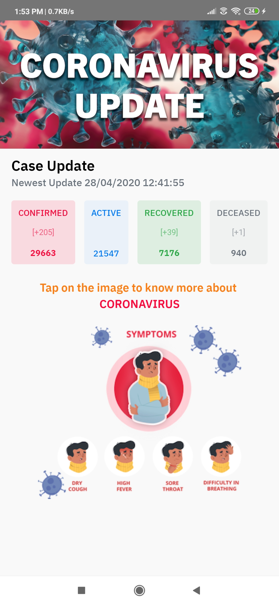

# React_Native_Covid19_Tracker
<h2>This is Open Source Android/ios react native Project</h2> 
<h3><i>It is simple Covid 19 Indian Tracker Mobile App </i></h3>
<ol>
   <strong><li>Highlights of this WebApp</li></strong>
      <ol type="i">
         <li> I used <strong><i>React Native</i></strong> to make this tracker app</li>
         <li> You can easily post blog from database and show to the html page. For example:-   
            Title, Descrption and also a images.</li>
         <li> User or visitor of the app can easily contact through the form to the admin or owner to the website</li>
   </ul>
</ul>
<h1> Some Screenshort of WebApp</h1>

